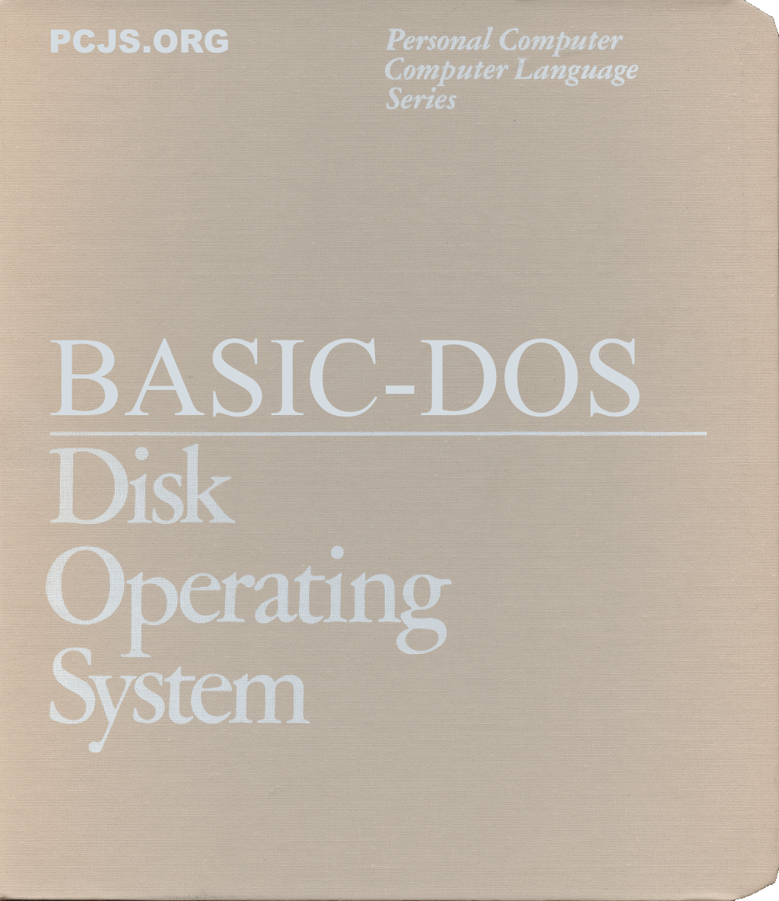

## PC DOS Reimagined

Read the [Blog](blog/), then check out the [Preview](preview/), which
highlights a few of the original [Demos](demos/).

## License

[BASIC-DOS](https://github.com/jeffpar/basicdos) is an open-source project
on [GitHub](https://github.com/jeffpar) released under the terms of an
[MIT License](/LICENSE.txt).



## Building BASIC-DOS

The updated build process requires the [PCjs](https://github.com/jeffpar/pcjs)
repository, along with the `v2` branch of the BASIC-DOS repository.

    git clone https://github.com/jeffpar/pcjs
    git clone https://github.com/jeffpar/basicdos
    cd basicdos
    git checkout v2

It's recommended that you also set environment variables to the locations of
the repositories and then update your PATH to include the PCjs directories for
the `diskimage.js` and `pc.js` utilities:

    $ export PCJS="$HOME/pcjs"
    $ export BASICDOS="$HOME/basicdos"
    $ export PATH="$PATH:$PCJS/tools/diskimage:$PCJS/tools/pc"

Then use `diskimage.js` to get a `tools` disk image from pcjs.org:

    $ cd $PCJS/tools/pc
    $ diskimage.js https://harddisks.pcjs.org/pcx86/10mb/MSDOS330-C400.json disks/tools.json

Now you're ready to build BASIC-DOS, using `pc.js` to load the `tools` disk
image as drive C and the BASIC-DOS source code as drive D:

    $ pc.js --disk tools.json $BASICDOS/software/pcx86/src -n
    [Press CTRL-D to enter command mode]
    C:\>dir

     Volume in drive C is PCJS       
     Directory of  C:\

    COMMAND  COM    25308   2-02-88  12:00a
    AUTOEXEC BAT      185   9-28-23   2:39p
    CONFIG   SYS       22   1-01-80  12:03a
    DOS          <DIR>      9-05-23  11:37a
    MBR          <DIR>      9-27-23   6:24a
    PUZZLED      <DIR>      9-05-23  11:37a
    TMP          <DIR>      1-01-80  12:13a
    TOOLS        <DIR>      9-05-23  11:37a
            8 File(s)   5726208 bytes free

    C:\>d:

    D:\>dir

     Volume in drive D is SRC        
     Directory of  D:\
    
    README   MD      3635  11-12-23   1:40p
    CONFIGS      <DIR>     11-12-23   2:29p
    MK       BAT      260  11-12-23   2:16p
    MKCLEAN  BAT      299  11-12-23   2:16p
    MSB          <DIR>     11-12-23   2:15p
    OS           <DIR>     11-07-23  10:09a
    TEST         <DIR>     11-12-23   2:23p
            7 File(s)    729088 bytes free

    D:\>mk
    Microsoft (R) Program Maintenance Utility  Version 4.02
    Copyright (C) Microsoft Corp 1984, 1985, 1986.  All rights reserved.
    
    ...

    D:>quit

Assuming the `mk` command was successful, you should now have everything you
need to boot and run BASIC-DOS.

The `pc.js` command below will build a 360K boot floppy (the largest floppy
supported by an IBM PC XT Model 5160) with the BASIC-DOS boot sector and system
files. If you have a folder containing additional files that you want included
on the floppy, specify it in place of the empty folder `disks/empty`.

    $ pc.js ibm5160 --floppy --system=bd:2A disks/empty 
    [Press CTRL-D to enter command mode]
    BASIC-DOS 2.00A
    Press a key to start...

## Tool Trivia

In keeping with the era for which BASIC-DOS is designed, it's built with
Microsoft Assembler (MASM) 4.0 and associated tools, circa 1985.  While we
could have opted for even older tools, the MASM 4.0 release strikes a nice
balance between vintage operation and modern tooling.

However, as with any old tools, there are idiosyncrasies that can catch you
by surprise.

One is how MASM encodes 32-bit and 64-bit floating-point numbers: by default,
it uses the Microsoft Binary Format (MBF) instead of the IEEE 754 format used
by 80x87 Intel coprocessors.  This is probably because Microsoft's original
floating-point emulation libraries were written using MBF and they didn't want
to spend time and resources creating new emulation libraries that supported
the newer IEEE 754 format.

So, by default, an assembly language data directive such as:

    DQ  1.0

will generate:

    00 00 00 00 00 00 00 81

instead of:

    00 00 00 00 00 00 F0 3F

And while neither the MASM 4.0 User Guide or Reference Manual discuss this,
it turns out that if you pass /R on the MASM command-line, MASM will use
the IEEE 754 format instead.  The stated purpose of /R is to generate 80x87
opcodes instead of emulation calls whenever using coprocessor instructions,
but another important consideration is encoding all floating-point number in
a compatible format (ie, IEEE 754 for coprocessors or MBF for the Microsoft
emulation library) -- which /R happens to do as well.

Other idiosyncrasies include some minor code generation quirks.  For example,
an instruction like:

    cmp	ah,UTILTBL_SIZE

should always generate 3 bytes (2 bytes for the opcode and 1 byte for the
immediate operand), but if a constant like UTILTBL_SIZE is calculated using
16-bit values, even if the result is 8 bits, MASM 4.0 will reserve 16 bits
and then replace the upper 8 bits with a NOP (0x90).

To eliminate the NOP, one work-around is to explicitly truncate the operand
with an 8-bit mask, as in:

    cmp	ah,UTILTBL_SIZE AND 255


