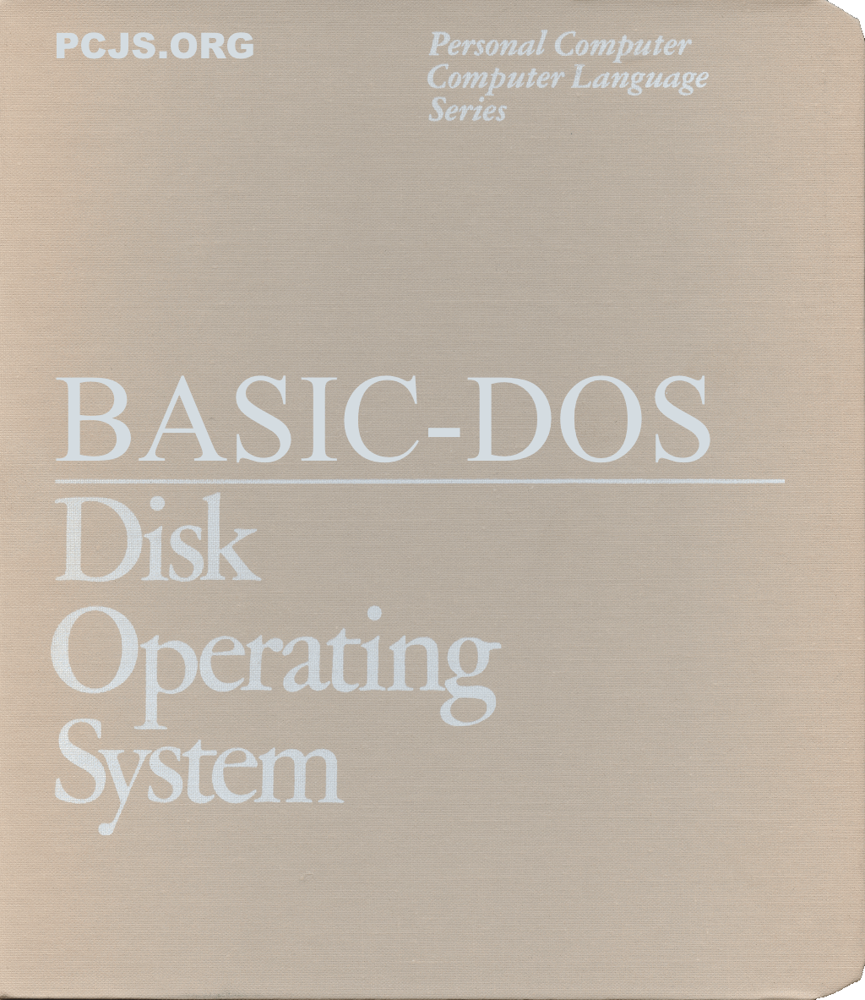

# PC DOS Reimagined

Read the [Blog](blog/), then check out the [Preview](preview/), which highlights a few of the original [Demos](demos/).

## Project Status

BASIC-DOS began as a technology demo: a reimagining of what the first IBM PC operating system *could* have been, with a unified DOS and BASIC command interpreter, preemptive multitasking sessions, and other features that PC DOS wouldn't offer for years (if ever).  The goal now is to turn it into a usable product.

It is not a goal to provide every PC DOS function, or to be 100% compatible with PC DOS.  BASIC-DOS implements what its own commands and BASIC programs need, plus enough of the PC DOS API to run typical DOS programs, so unchecked items below are possibilities, not commitments.

This section tracks what's been completed (**[x]**) and what remains (**[ ]**).  Items marked *partial* work, but with known gaps.

### Boot and System Configuration

- [x] Boot sector that loads the BASIC-DOS drivers, kernel, and interpreter
- [x] Boot prompt when a hard disk is detected (press **Esc** to boot from it)
- [x] Booting BASIC-DOS from a hard disk partition (eg, a disk built with `pc.js --sys=bd:2`), which becomes the default drive
- [x] CONFIG.SYS support for BOOTKEY, BUFFERS, CONSOLE, DEBUG, FILES, MEMSIZE, SESSIONS, SHELL, SKIP, and SWITCHAR
- [x] SKIP= lists built-in drivers (by their exact device names, separated by commas) that should not be loaded (eg, `SKIP=CON,FPU$`); a skipped driver is never initialized, and its memory is reclaimed
- [ ] Installable device drivers (DEVICE=)
- [ ] Critical ("hard") error handling (eg, "Abort, Retry, Ignore")

### Device Drivers

- [x] CON, with multiple console contexts (one per session)
- [x] COM, AUX, LPT, PRN, NUL, CLOCK$, and PIPE$ devices
- [x] MOUSE$, a serial mouse driver (loaded only if a Microsoft-compatible mouse responds on a COM port at boot), with a minimal INT 33h interface (functions 00h-04h, 07h, 08h, and a BASIC-DOS function that returns queued button events), and a pointer drawn in MDA and CGA modes that preserves anything drawn over it
- [x] Interrupt-driven, asynchronous I/O for CON and COM
- [x] Floppy disk reads, including multi-track requests and requests that cross 64K boundaries
- [x] Floppy disk writes
- [x] Media check and BPB rebuilds (reads PC DOS 1.x and 2.x diskettes)
- [x] *partial*: Hard disk reads and writes (HDC$), for the FAT12 primary partitions of up to two PC XT hard disks, which become drives C:, D:, etc. (drives A: and B: are always reserved for diskettes)
- [ ] Write-with-verify (DDC_WRITEV), formatting, and FAT16 hard disks
- [ ] "Popup" and background console contexts

### Kernel: Processes, Memory, and Sessions

- [x] COM and EXE program loading, PSPs, EXEC, and exit codes
- [x] Memory allocation (MCBs), including per-program heap requests, and allocation from the top of memory (MCBTYPE_HIGH), which the interpreter uses for its own blocks so that the memory below them stays contiguous
- [x] DOS_UTL_QRYMEM queries any memory block, or the highest free block (which COMMAND.COM uses to keep a copy of its transient portion while a program runs)
- [x] INT 32h utility functions numbered contiguously (00h-24h) and grouped by purpose (see the [Technical Reference](docs/bdtech/util/))
- [x] Preemptive multitasking of multiple sessions
- [x] CTRL-C/CTRL-Break handling, and CTRL-ALT-DEL session aborts (vectors 08h, 09h, 1Bh, and 1Ch that a terminated program left hooked, like MSBASIC's, are restored)
- [ ] Session STOP/END operations (currently TODOs)
- [ ] TSR support (INT 27h and INT 21h function 31h)
- [ ] Environment segments for EXEC (EPB_ENVSEG)

### Kernel: File System

- [x] FAT12 file reading
- [x] Handle-based open, read, seek, IOCTL, and close
- [x] Find first/next, disk info (free space), and current drive/DTA
- [x] Handle-based file creation (function 3Ch) and writing (function 40h)
- [x] File deletion (function 41h) and renaming (function 56h)
- [x] FAT cluster allocation and freeing
- [x] Write-back of modified FAT and directory buffers (every FAT copy is updated), including when the buffer is reused, on file close, disk reset, and restart
- [x] FCB support: open, create, close, sequential, random, and random block reads and writes, find first/next, delete and rename (with wildcards), file size, set relative record, and filename parsing (functions 0Fh-17h, 21h-24h, and 27h-29h), including extended FCBs and device names
- [x] Truncating/extending a file with a zero-length write (function 40h, and FCB function 28h)
- [ ] Enforcing the read-only attribute on open, and getting/setting file attributes (function 43h) and date/time (function 57h)
- [x] Subdirectories: paths (separated by `/`, or `\` when SWITCHAR is `/`) in all file functions, MKDIR and RMDIR (functions 39h and 3Ah), subdirectories that grow as needed, and per-session current directories for every drive (CHDIR and GETCWD, functions 3Bh and 47h)
- [ ] Renaming a file into a different directory
- [x] Absolute disk reads and writes: opening a volume (eg, `C:`) as a file gives read/write access to its sectors, in place of INT 25h and INT 26h
- [x] Configurable disk buffer cache (BUFFERS=2-32, default 2), with least-recently-used replacement for FAT and directory sectors; file data is transferred directly by the disk drivers
- [ ] FAT16 and extended partitions

### Command Interpreter: DOS Commands

- [x] CD (CHDIR), COPY, DATE, DEL, DIR, EXIT, HELP, KEYS, MD (MKDIR), MEM, RD (RMDIR), RESTART, TIME, TYPE, and VER
- [x] The prompt displays the current drive and directory (eg, `C:/SUBDIR>`), and switches use `-` by default (eg, `MEM -D`), since `/` is the default path character
- [x] Running COM, EXE, BAT, and BAS files, and loading programs into other sessions
- [x] BAT and BAS files can run other BAT and BAS files and then continue (no CALL command required); a nested BAS file gets its own variables
- [x] Pipes (`|`) and output redirection (`>` creates or truncates the output file, `>>` appends to it), including redirection at the end of a pipeline (eg, `DIR | CASE > TEST`)
- [x] `:>` and `:>>` redirect the output of an entire line, including BASIC statements, where `>` means "greater than" (eg, `PRINT "hello world" :> TEST`), at the prompt and in BAT and BAS files
- [x] COPY creates (or truncates) the output file, and refuses to copy a file onto itself
- [x] A DOS command (internal or external) ends at a colon that begins a word, so other commands can follow it on the same line (eg, `DIR *.BAS : PRINT "done"`), at the prompt and in BAT and BAS files
- [x] A command that fails (internal or external, eg, "Unable to find" or "Unable to open") ends a BAT or BAS file; a program's non-zero exit code doesn't (use ERRORLEVEL)
- [x] Any command that accepts a file name (eg, COPY, DEL, DIR, LOAD, SAVE, TYPE, CD, MD, RD) also accepts a string variable whose value is the file name (eg, `DIR D$` or `COPY CON NAME$`), and quoted file names (eg, `TYPE "TEST$"`)
- [x] DEL/ERASE
- [x] ECHO ON/OFF and the `@` prefix in BAT files: every BAT file starts with ECHO OFF (unlike PC DOS, so BAT files behave like BAS files unless ECHO ON is used), echoed lines are displayed with a `@` in front, and a leading `@` is ignored at the prompt, too
- [x] A BAS file run from the command prompt remains loaded when it ends, along with its variables (like MSBASIC), so it can be LIST'ed or RUN again; RUN reuses the program's compiled code (unless the program or its variables have changed since), so it starts immediately
- [x] Resident and transient portions: before running a COM or EXE file, COMMAND.COM frees idle variable blocks and discards its transient portion (about 23K), restoring it when the program ends (from a copy at the top of free memory, if the program didn't overwrite it, or else from COMMAND.COM); MEM includes the transient portion in its free memory total
- [x] Filters: CASE, FIND (-C, -I, -N, -V), MORE, and SORT (-R, -+n); FIND, MORE, and SORT also accept file names, and every filter treats CTRL-Z as the end of input
- [x] Pipelines with more than one filter (eg, `TYPE FILE | SORT | MORE`): when a session ends, its output pipe receives end-of-input
- [x] When any command of a pipeline fails (eg, a program that can't be found, or no session available for it), the error is reported, the commands already running in other sessions are ended (DOS_UTL_END), and the first command never runs; and when a command stops reading a pipe early, the command writing to it gets a write error instead of waiting forever
- [x] LIST VARS: list preserved strings (including PATH$), scalar values, and array dimensions in the current session
- [x] PATH$: the directories searched for programs (eg, `LET PATH$="A:/;A:/BASIC;A:/TOOLS;A:/TESTS"` on a SHELL line in CONFIG.SYS); unlike other variables, it survives NEW and CLEAR
- [x] Every BASIC-DOS disk has the same layout: BASDEV.COM, BASDOS.COM, COMMAND.COM, CONFIG.SYS, AUTOEXEC.BAT (if any), and HELP.TXT in the root, BASIC samples in BASIC, utilities in TOOLS, and test and demo programs in TESTS; HELP finds HELP.TXT in the root of the boot drive from any directory
- [ ] Input redirection (`<`)
- [ ] Batch file features: replaceable parameters (`%1`-`%9`), environment variables (SET), `ECHO message`, IF EXIST, FOR ... IN ... DO, SHIFT, and PAUSE (see [Batch Files](docs/bdman/lang/#batch-files) for the BASIC-DOS equivalents)
- [x] REN/RENAME/MV: rename files and directories and move them between directories on the same drive
- [x] Loading tokenized (binary) BAS files saved by BASICA or GW-BASIC (eg, the samples on the PC DOS diskettes): they're converted back to text as they're loaded (as LIST would display them), including MBF floating-point constants (converted to IEEE doubles and formatted by FPU$); protected BAS files are still rejected with "Invalid file format"
- [ ] LOAD inside a running BAS or BAT file (for now, it's an error, "Not allowed in a program", because it would replace the running file's own text)
- [ ] Disk utilities (eg, FORMAT, CHKDSK, SYS)

### Command Interpreter: BASIC Language

- [x] 32-bit integer variables, constants, and expressions (including AND, OR, XOR, EQV, IMP, NOT, MOD, and shifts)
- [x] Type suffixes (`%` for integers, `#` or `!` for doubles, and `$` for strings), where the type is part of a variable's identity (eg, after DEFINT A-Z and then DEFDBL A-Z, `A` is a new variable, separate from `A%`), and on numeric constants (eg, `1.5#`, `2!`, and `7%`)
- [x] String variables, concatenation, and comparisons
- [x] String functions: ASC, CHR$, DATE$, FRE, HEX$, INKEY$, INSTR, LCASE$, LEFT$, LEN, MID$, OCT$, RIGHT$, SPACE$, STR$, STRING$, TIME$, UCASE$, and VAL
- [x] String pool management: temporary strings are released as soon as they're consumed, strings are compacted (and empty string blocks freed) when space runs out, and runtime string errors (eg, "String too long") abort the program cleanly
- [x] CLS, COLOR, DEF FN (including string functions and parameters), DEFDBL, DEFINT, DEFSNG, DEFSTR, ECHO, GOTO, IF/THEN/ELSE, LET, PRINT, REM (and `'` remarks), and RETURN
- [x] Assignments without LET in BAS and BAT files (LET is still required on the command line)
- [x] LOAD, LIST, NEW, RUN, and SAVE
- [x] Entering programs at the prompt: a line that begins with a line number is added to the loaded program (in line number order, replacing any line with the same number), and a line number by itself deletes that line; AUTO, DELETE, EDIT, and LIST with line ranges (eg, `LIST 100-200`) work with program lines, too
- [x] Functions: ARG$ (command-line arguments of a BAS or BAT file), ERR, ERRORLEVEL, MAXINT, PEEK, RND, and RND%
- [x] Arrays of integers, doubles, and strings, with up to 255 dimensions: DIM, ERASE, OPTION BASE, automatic dimensioning (with a largest subscript of 10) of arrays used without DIM, and "Subscript out of range" and "Duplicate definition" errors
- [x] Control flow: END, FOR/NEXT (with STEP, and integer or double loop variables), GOSUB/RETURN, ON ... GOTO/GOSUB, STOP, and WHILE/WEND
- [x] Memory management that's forgiving of low or fragmented memory: code, text, variable, and string blocks are modest (4K) blocks that are chained together as needed (generated code continues in another code block via a far JMP), no block type takes more than a quarter of the largest free block, and smaller blocks (down to 512 bytes) are used when necessary
- [ ] Limitations: a DEF function's code must fit in a single block, a function block ends at its first RETURN (so RETURN can't be conditional), and each array requires a single block (64K max)
- [ ] Specific error messages for compile-time errors (eg, "NEXT without FOR" and "WHILE without WEND" are currently reported as syntax errors)
- [ ] STOP's "Break" message (STOP is currently the same as END)
- [x] DATA, READ, and RESTORE (DATA items are found in the program's text as READ needs them)
- [x] MOUSE ON/OFF and the MOUSE(*n*) function (modeled on MSBASIC's PEN), which returns button events, their positions, and the current position and buttons, in pixels (graphics modes) or columns and rows (text modes); the pointer is hidden while graphics statements run (until the next MOUSE function), and the mouse is turned off when a BAS program ends
- [x] INPUT and LINE INPUT, from the keyboard or an open file
- [ ] The MID$ statement (ie, `MID$(A$,N[,M]) = B$`)
- [ ] `&H` and `&O` prefixes in VAL
- [ ] Comma print zones in PRINT (commas currently print a tab)
- [x] Sequential file I/O: OPEN FOR INPUT, OUTPUT, and APPEND, CLOSE (and RESET), PRINT #, WRITE #, INPUT #, LINE INPUT #, EOF, LOC, and LOF
- [x] Random access file I/O: OPEN FOR RANDOM with LEN, FIELD, LSET, RSET, GET #, PUT #, and binary conversion functions (CVI, CVL, CVD, MKI$, MKL$, and MKD$)
- [x] *partial*: Error handling (ON ERROR GOTO, RESUME *line*, ERROR, and ERR; see the DONKEY.BAS checklist)
- [ ] Runtime error messages for numeric errors

### Floating-Point

BASIC-DOS will support only one floating-point type: IEEE 754 64-bit (double-precision) values.  It won't use any MBF (Microsoft Binary Format) code.

- [x] Parser support for floating-point constants (CLS_FLOAT tokens)
- [x] Numeric variables default to doubles (unless DEFINT is used), and DEFSNG is treated as DEFDBL
- [x] MBF-based MSLIB option removed
- [x] FPU$ device driver, which detects an 8087 at boot and provides a table of floating-point functions (IOCTL_GETFPU)
- [x] 8087 functions: arithmetic (including `^`), comparisons, conversions between longs and doubles, ABS, INT, FIX, and SQR
- [x] Software emulation of all FPU$ functions for systems without an 8087
- [x] The interpreter reports at startup whether floating-point uses an 8087, emulation, or is disabled (no FPU$ driver); when disabled, variables default to integers and "/" and "^" are integer operations
- [x] String-to-double (FPU_ATOD) and double-to-string (FPU_DTOA) conversions, and `%f` support in sprintf
- [x] Expression generator support for mixed integer/floating-point operations (promotion and demotion rules), using FPU$ calls
- [x] Floating-point constants and PRINT output in BASIC programs
- [x] BASIC math functions: ABS, ATN, COS, EXP, FIX, INT, LOG, SIN, SQR, and TAN
- [x] FPUTESTS, run with and without an 8087 by `tools/tests/quick.sh`
- [x] Fast software emulation: doubles are unpacked and packed in registers, division uses the 8086's DIV (16 bits at a time), multiplication sums its partial products a column at a time, and SIN, COS, TAN, ATN, LOG, and EXP use fdlibm's minimax polynomials; arithmetic results match the 8087 bit for bit, and math functions are within 1 ulp (see the [benchmarks](preview/part6/))
- [x] STR$ formats integer values directly, without floating-point conversions
- [ ] Saving and restoring 8087 state on session switches (FPU$ functions currently disable interrupts instead), and better error reporting for FPU exceptions
- [x] Unused floating-point utility function stubs (DOS_UTL_ATOF64, DOS_UTL_I32F64, and DOS_UTL_OPF64) removed, since FPU$ supersedes them

### DONKEY.BAS

[DONKEY.BAS](https://www.pcjs.org/software/pcx86/app/ibm/basic/1.00/donkey/), from the original IBM PC DOS 1.00 diskette, is a good test of BASIC-DOS's compatibility with IBM PC BASIC programs.  These are the items it needed, followed by related work that remains.  Since BASIC-DOS compiles an entire program before running it, every statement must at least be recognized, even ones that DONKEY.BAS rarely or never runs (eg, PLAY and CHAIN).

- [x] SCREEN 0, 1, and 2 (text, 320x200, and 640x200 modes), WIDTH 40 and 80, and LOCATE (row, column, and cursor visibility)
- [x] CON driver IOCTLs to get and set the video mode and cursor position; a mode change (whether by IOCTL or by INT 10h directly) turns the console into a full-screen, borderless context that uses INT 10h passthrough, so text output and CLS work in graphics modes
- [x] COLOR with blinking foregrounds (16-31), omitted arguments (eg, `COLOR ,1`), and SCREEN 1's background and palette
- [x] KEY ON and KEY OFF (accepted, but no-ops, since BASIC-DOS doesn't display function keys)
- [x] DEF SEG, PEEK, and POKE (`DEF SEG` alone selects BASIC-DOS's own data segment, so DONKEY.BAS's `POKE 106,0` is harmless)
- [x] RND as a floating-point function (0 <= RND < 1); RND% still returns an integer
- [x] String constants with no closing quote at the end of a line
- [x] ON ERROR GOTO (and GOTO 0), RESUME *line*, ERROR, and ERR, with MSBASIC's error numbers for runtime errors
- [x] PLAY (notes, N, O, <, >, L, P, T, MN/ML/MS, and dots; MF/MB are ignored, since music always plays in the foreground)
- [x] SOUND *frequency*,*duration*
- [x] CHAIN *file* (runs the BAS file, then ends the program; the line number is ignored)
- [x] PSET, PRESET, LINE (including `LINE -(x,y)`, B, BF, and an omitted color), PAINT, and DRAW (U, D, L, R, E, F, G, H, M, B, N, C, and S), drawing directly into CGA memory in modes 4-6
- [x] GET and PUT (PSET, PRESET, XOR, OR, and AND), using integer arrays (passed by name) in BASICA's image format, with one 16-bit word per element, so programs that build images by hand (like DONKEY.BAS's `B%`) work
- [x] Syntax errors report the program's line number (eg, "Syntax error in line 1160") instead of the line's position in the file
- [x] DONKEY.BAS runs (see the [DONKEY.BAS demo](demos/basic/))
- [x] Performance: PUT and GET copy whole bytes (shifting and masking each row in registers), horizontal lines, BF, and PAINT fill whole bytes, and the video mode is cached, so graphics statements make no driver or BIOS calls; SOUND returns immediately (as in MSBASIC, the next SOUND waits for it to finish, and the CLOCK$ driver turns it off), so DONKEY.BAS is paced at one loop per tick, like MSBASIC
- [x] CIRCLE (for CIRCLE.BAS, one of the other PC DOS 1.00 samples on the demo disk), using MSBASIC's algorithm and integer math (angles and aspects are converted from doubles without FPU$), so it draws the same pixels as MSBASIC, about twice as fast
- [x] CLEAR (resets variables and erases arrays; its sizes are ignored)
- [x] PAINT fills through pixels that already have the paint color (like MSBASIC), so it draws the same pixels as MSBASIC; it scans rows a byte at a time (using tables of each byte's boundary and paint-colored pixels), and its seeds remember their direction and parent span, so it never rescans the row it came from, making it faster than MSBASIC's
- [x] A BASIC keyword typed alone that isn't a valid statement (eg, CIRCLE) runs the program with that name (eg, CIRCLE.BAS)
- [x] LINE (and DRAW and CIRCLE's lines to the center) use MSBASIC's line algorithm, so they draw the same pixels as MSBASIC, but lines whose endpoints are on the screen are drawn by stepping the video address and pixel mask directly (about 4 times faster than before)
- [ ] More performance: text output in graphics modes goes through the CON driver and the BIOS
- [ ] Graphics features that the samples don't use: STEP coordinates, POINT, DRAW's A, TA, X, and "=variable" commands, and GET/PUT with floating-point arrays
- [ ] RESUME and RESUME NEXT (which need the location of the error), and ERL
- [x] When a BAS program ends (or is aborted), its video mode is restored (undoing any SCREEN or WIDTH), and when a console returns to its original mode, its original geometry (eg, its border) is restored, too
- [ ] Keeping other sessions on the same adapter from writing to the screen while it's in another mode; also, the CON driver restores the BIOS's video data after every INT 10h call, so programs that read the BIOS's video mode (0:449h) may see a stale value

### Build, Tests, and Documentation

- [x] Builds with MASM 4.0 using `mk.sh` (PC.js), which builds release binaries by default (`mk.sh debug` builds DEBUG binaries, with run-time assertions) and also updates the BASIC-DOS demo disks after a successful build
- [x] DOSTESTS: CALL 5, memory allocation, file create/write/read-back, file sharing, path character, and file rename/delete tests
- [x] STRFUN and STRPOOL: BASIC string function tests, and string pool stress and leak tests
- [x] ARRAYS: BASIC array tests (including leak tests)
- [x] FLOW: BASIC control flow tests
- [x] FILEIO: BASIC sequential and random access file tests
- [x] MOVES: file and directory moves, destination growth, sharing, and ancestry checks
- [x] Unattended test runs using `tools/tests/quick.sh` (boots BASIC-DOS with and without an 8087, runs FPUTESTS, DOSTESTS, STRFUN, STRPOOL, ARRAYS, FLOW, CMDS, VARS, FILEIO, MOVES, and PRINTF, and reports whether the tests passed)
- [x] CMDS: command tests (pipes, redirection, TYPE, DEL, TIME -D, HELP, SOUND, remarks, and hex constants)
- [x] `tools/tests/chkdsk.sh` runs MS-DOS 3.20 CHKDSK on a diskette image saved by a test session (see `QUIT /S` in `pc.js`)
- [ ] More tests (eg, BASIC language and CMD command tests)
- [x] BENCH.BAS and MICRO.BAS benchmarks, which run unchanged in BASIC-DOS, BASICA, and GW-BASIC (see the [results](preview/part6/)); `tools/tests/bench.sh` runs BENCH.BAS in all six configurations (each with and without an 8087) and prints the results in seconds
- [x] HELP for commands, functions, and constants (eg, `HELP MID$`), found by searching HELP.TXT, so new entries need no other changes
- [x] [BASIC-DOS Manual](docs/bdman/): using BASIC-DOS, all commands and functions, programming, and configuration
- [x] [BASIC-DOS Technical Reference](docs/bdtech/): architecture, DOS functions, utility functions, device drivers, the FPU$ interface, and internal structures

## Roadmap

These are the next steps, roughly in priority order:

1. Add input redirection
2. The read-only attribute, and file attribute/date/time functions
3. Remaining string and input/output features (the MID$ statement, `&H` and `&O` prefixes in VAL, and comma print zones)
4. The rest of runtime error handling (RESUME, RESUME NEXT, and ERL)
5. Critical error handling

## License

[BASIC-DOS](https://github.com/jeffpar/basicdos) is an open-source project on [GitHub](https://github.com/jeffpar) released under the terms of an [MIT License](/LICENSE.txt).



## Building BASIC-DOS

Everything needed to build BASIC-DOS is in this repository, including the `pc.js` utility (in `tools/pc`) and the MS-DOS 3.20 disk image with MASM 4.0 and associated tools that the build runs on.  Just clone the repository and install its Node.js dependencies:

    git clone https://github.com/jeffpar/basicdos
    cd basicdos
    npm install

If you also want successful builds to update the BASIC-DOS demo disks, you'll need the [PCjs](https://github.com/jeffpar/pcjs) repository (for its `diskimage.js` utility), with the `PCJS` environment variable set to its location:

    git clone https://github.com/jeffpar/pcjs
    export PCJS="$HOME/pcjs"

Now you're ready to build BASIC-DOS, using the `mk.sh` script, which runs `pc.js` with MS-DOS 3.20 and the build tools on drive C and a 30Mb disk containing the BASIC-DOS source code on drive D, and builds release binaries (use `mk.sh debug` to build DEBUG binaries instead).  The script forces a rebuild when switching between release and DEBUG modes:

    $ ./mk.sh
    [Press CTRL-D to enter command mode]

    C:\>D:

    D:\>MK
    Microsoft (R) Program Maintenance Utility  Version 4.02
    Copyright (C) Microsoft Corp 1984, 1985, 1986.  All rights reserved.

    ...

    D:\>QUIT

Any files that the build modifies are written back to the `software/pcx86/src` directory.  A successful build runs QUIT automatically, after which `mk.sh` updates the demo disks (if `PCJS` is set); if a build fails and you don't want the demo disks updated, use `pc.js`'s "abort" command instead.

The `boot.sh` script then builds and boots a 360K floppy (the largest floppy supported by an IBM PC XT Model 5160) containing the BASIC-DOS boot sector and system files, along with the files in the `configs/console/serial/fpe` folder (including CONFIG.SYS and AUTOEXEC.BAT) and the test binaries that `tools/tests/prep.sh` copies there:

    $ ./boot.sh
    [Press CTRL-D to enter command mode]
    BASIC-DOS 2.00
    Press a key to start...

The `bootfpu.sh` script does the same thing, but on an `ibm5160-fpu` machine (which has an 8087 coprocessor), using the `configs/console/serial/fpu` folder; `boot.sh` uses a machine without an 8087, where BASIC-DOS must emulate floating-point operations.

The `boothd.sh` script boots BASIC-DOS from a 10Mb hard disk that `pc.js` builds from the `tools/pc/disks/hdsrc` directory (with `--sys=bd:2`, so the BASIC-DOS system files are copied to the disk), on an `ibm5160` machine.  Its CONFIG.SYS (from `configs/console/serial/fpe`) uses a serial console, so BASIC-DOS's input and output go through the terminal:

    $ ./boothd.sh

The `tools/tests/testhd.sh` script instead builds a BASIC-DOS boot diskette (from the `configs/console/bios` folder, so it uses the keyboard and screen) and boots it on an `ibm5160` machine whose 10Mb hard disk is built from a directory (`tools/pc/disks/hdsrc` by default, which is created with a few sample files if it doesn't exist), so that BASIC-DOS can be tested with an MS-DOS-formatted drive C:.  Press a key (other than **Esc**) at the boot prompt to start BASIC-DOS:

    $ tools/tests/testhd.sh [hard disk directory] [config folder]

That hard disk is formatted by MS-DOS 3.20 (so it also contains hidden MS-DOS system files).  With either script, changes to the hard disk are not saved back to the directory.

Finally, `tools/tests/quick.sh` boots both configurations unattended, runs the test programs (FPUTESTS, DOSTESTS, and the BASIC tests, including CMDS.BAT, which tests pipes and redirection), and reports whether the tests passed.

## Tool Trivia

In keeping with the era for which BASIC-DOS is designed, it's built with Microsoft Assembler (MASM) 4.0 and associated tools, circa 1985.  While we could have opted for even older tools, the MASM 4.0 release strikes a nice balance between vintage operation and modern tooling.

However, as with any old tools, there are idiosyncrasies that can catch you by surprise.

One is how MASM encodes 32-bit and 64-bit floating-point numbers: by default, it uses the Microsoft Binary Format (MBF) instead of the IEEE 754 format used by 80x87 Intel coprocessors.  This is probably because Microsoft's original floating-point emulation libraries were written using MBF and they didn't want to spend time and resources creating new emulation libraries that supported the newer IEEE 754 format.

So, by default, an assembly language data directive such as:

    DQ  1.0

will generate:

    00 00 00 00 00 00 00 81

instead of:

    00 00 00 00 00 00 F0 3F

And while neither the MASM 4.0 User Guide or Reference Manual discuss this, it turns out that if you pass /R on the MASM command-line, MASM will use the IEEE 754 format instead.  The stated purpose of /R is to generate 80x87 opcodes instead of emulation calls whenever using coprocessor instructions, but another important consideration is encoding all floating-point number in a compatible format (ie, IEEE 754 for coprocessors or MBF for the Microsoft emulation library) -- which /R happens to do as well.

Other idiosyncrasies include some minor code generation quirks.  For example, an instruction like:

    cmp	ah,UTILTBL_SIZE

should always generate 3 bytes (2 bytes for the opcode and 1 byte for the immediate operand), but if a constant like UTILTBL_SIZE is calculated using 16-bit values, even if the result is 8 bits, MASM 4.0 will reserve 16 bits and then replace the upper 8 bits with a NOP (0x90).

To eliminate the NOP, one work-around is to explicitly truncate the operand with an 8-bit mask, as in:

    cmp	ah,UTILTBL_SIZE AND 255


